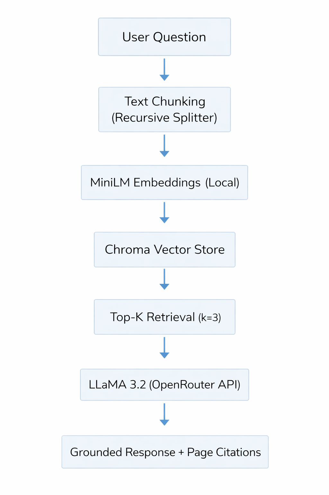
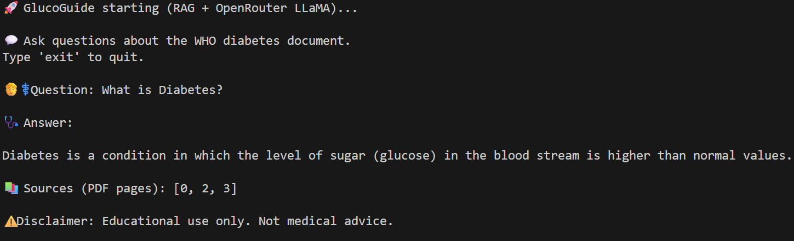

# 🩺 GlucoGuide — Medical Document RAG System

GlucoGuide is a Retrieval-Augmented Generation (RAG) system built to answer questions strictly from structured diabetes-related medical PDF documents (e.g., WHO diabetes guidelines).

The system retrieves relevant sections from the document and generates answers only when the information is explicitly present in the source.

If the answer is not found in the document, the system responds:

> "I don't know based on the provided document."

This behavior is intentional to prevent hallucinations and unsupported medical claims.

---

## 🚀 Highlights

- Implemented complete Retrieval-Augmented Generation (RAG) pipeline
- Strict grounding to eliminate hallucinations
- Persistent local vector database using Chroma
- Modular configuration via config.py
- Secure API handling using environment variables
- Fully reproducible dependency setup

---

## 🧠 Design Decisions

- Chunk size: 500 with 100 token overlap for semantic continuity  
- Top-k retrieval: 3  
- Temperature: 0.2 to maintain factual consistency  
- Persistent local vector store for reproducibility  
- Explicit refusal mechanism to prevent hallucinated responses  

---

## 🏗️ System Architecture



---

## 🖥️ Example Console Output

Below is an example interaction with the system:



---

## 🧩 Tech Stack

### Embeddings
- sentence-transformers/all-MiniLM-L6-v2
- Local CPU execution using HuggingFace

### Vector Database
- ChromaDB
- Persistent local storage

### LLM
- meta-llama/llama-3.2-3b-instruct
- Accessed via OpenRouter API

### Core Libraries
- LangChain
- LangChain Community
- LangChain Chroma
- LangChain HuggingFace

### Supporting Libraries
- HuggingFace Transformers
- PyPDF
- Python-dotenv
- NumPy / SciPy / Scikit-learn

---

## 📁 Project Structure

```
GlucoGuide/
│
├── src/
│   ├── __init__.py
│   ├── config.py
│   └── main.py
│
├── data/
│   ├── raw/          # Place WHO diabetes PDF here
│   └── processed/    # Chroma DB (auto-generated)
│
├── docs/
│   ├── architecture.png
│   └── example-output.png
│
├── .gitignore
├── LICENSE
├── requirements.txt
└── README.md
```

---

## ⚙️ How It Works

1. Load a diabetes-related medical PDF document (user-provided)
2. Split text into overlapping chunks
3. Generate vector embeddings using MiniLM.
4. Store embeddings inside a persistent Chroma vector database.
5. Convert user query into embedding
6. Retrieve the most relevant document chunks.
7. Provide retrieved context to the LLM.
8. Generate a grounded answer based strictly on retrieved context.

---

## 🚀 How To Run

### 1️⃣ Clone Repository

```bash
git clone https://github.com/UtkarshJain05/GlucoGuide.git
cd GlucoGuide
```

---

### 2️⃣ Create Virtual Environment

```bash
python -m venv venv
venv\Scripts\activate   # Windows
```

---

### 3️⃣ Install Dependencies

```bash
pip install -r requirements.txt
```

---

### 4️⃣ Add Environment Variable

Create a `.env` file in project root:

```
OPENAI_API_KEY=your_openrouter_api_key_here
```

(Used for OpenRouter LLM access)

---

### 5️⃣ Add Your Own PDF Document

This repository does NOT include the WHO PDF.

You must place your own PDF file inside:

```
data/raw/
```
Then update the filename inside `src/config.py`.

Example:

```python
PDF_PATH = RAW_DATA_DIR / "your_document.pdf"
```

The system will process whatever PDF is placed in the `data/raw/` directory.

---

### 6️⃣ Run Application

```bash
python src/main.py
```

You can now ask questions about the document.

Type `exit` to quit.

---

## 🧪 Example Behavior

**Question:**
> What is diabetes?

**Answer:**
> Diabetes is a condition in which the level of sugar (glucose) in the blood is higher than normal...

**Sources:**
> PDF pages are displayed.

---

**Question:**
> What is the cure for diabetes?

**Answer:**
> I don't know based on the provided document.

---

## 🔐 Security

- API keys stored in `.env`
- `.env` excluded via `.gitignore`
- Processed vector database is ignored.
- No hardcoded secrets

---

## 📌 Disclaimer

This project demonstrates a controlled document-grounded RAG pipeline designed to minimize hallucinated responses.

It is intended for educational and research purposes only and does not provide medical diagnosis or treatment advice.

---